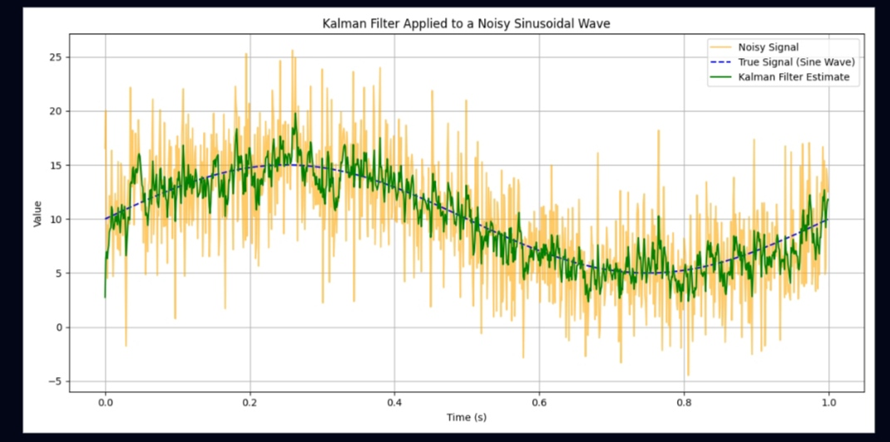

## Kalman Lab

Дослідження впливу параметрів:

1. Матриця коваріацій шуму процесу.
При збільшенні значення матриці коваріації шуму процесу фільтр Кальмана більше довіряє вимірюванням і менше передбаченням моделі.

Початкові значення: F = 1 H = 1 Q = 1 R = 10 P = 1 x = 0

Q = 1:

Q = 10

Q = 100

2. Матриця коваріації шуму вимірювання

Початкові значення: F = 1 H = 1 Q = 1 R = 1 P = 1 x = 0

У разі збільшення значення матриці коваріації шуму вимірювання знижується довіра до вимірювання, і навпаки, зменшення цього значення робить фільтр Калмана більш чутливим до нових вимірювань.

R = 1

R = 10 

R = 100

Початкова матриця коваріації

Початкові значення: F = 1 H = 1 Q = 1 R = 10 P = 0.1 x = 0

3. Збільшення призводить до того, що фільтр на початку стає менш впевненим у своєму стані. При зменшенні фільтр більш впевнений у початкових оцінках, тому на початку реакції на зміни будуть повільнішими.

P = 0.1

P = 1

P = 10

Початкова оцінка стану

Початкові значення: F = 1 H = 1 Q = 1 R = 10 P = 1 x = 0

4. Якщо початкова оцінка не відповідає реальному початковому стану, фільтру знадобиться більше часу на коригування. Якщо початкова оцінка близька до реального значення, фільтр швидко стабілізується і буде давати точніші результати від самого початку.

x = 0

X = 10

X = 50 

5. Постійна складова сигналу.

При збільшенні зсуву фільтр зможе адаптуватися до нових середніх значень сигналу, але це може зайняти більше часу. Зменшення зсуву дозволить швидше відстежувати зміни. 

offset = 0

offset = 10

offset = 50

6. Загальний час моделювання

При збільшенні часу, фільтр має більше часу для стабілізації. Зменшення часу може призвести до того, що фільтр не встигне повністю "налаштуватися", і його оцінки залишаться неточними або нерівномірними. 

total_time = 1

total_time = 0.3 

total_time = 5

Порівняння результатів

1. 
Q = 1; R = 10; P = 1; x = 0; offset = 10; total_time = 1;

Помірне значення Q дозволяє фільтру збалансовано реагувати на зміни, пристосовуючись до сигналу. Високе значення R свідчить про довіру до вимірювань, через що фільтр активно коригує свої оцінки, навіть якщо вимірювання зазнають шуму. 

2. Q = 0.1; R = 1; P = 0.1; x = 5; offset = 15; total_time = 0.5;

Низьке значення Q робить фільтр більш впевненим у своїх прогнозах, через що він повільніше реагує на зміни в сигналі Низьке значення R означає високу довіру фільтра до даних вимірювань, тому коригування прогнозів стають незначними. Після фільтрації дисперсія може залишитися досить низькою, адже фільтр мінімально коригує результати, лише враховуючи шум.

3. Q = 5; R = 50; P = 10; x = 0; offset = 0; total_time = 5;

Високе значення Q знижує впевненість фільтра в прогнозах, роблячи його більш чутливим до змін у вимірюваннях. Висока дисперсія в R змушує фільтр менше довіряти вимірюванням, що може спричинити збільшення шуму в оцінках. Дисперсія перед фільтрацією буде високою, і хоча фільтр зменшить її, вона залишиться підвищеною через чутливість до шуму.

4. Q = 1; R = 1; P = 5; x = 10; offset = 5; total_time = 2;

Помірне значення Q дає змогу фільтру адаптуватися до шуму, не вдаючись до занадто різких коригувань. Низьке значення R дозволяє фільтру більше покладатися на вимірювання, що сприяє активнішій корекції.

5. Q = 2; R = 20; P = 0.5; x = 0; offset = 12; total_time = 3;

Значення Q, рівне 2, дозволяє фільтру зберігати помірну чутливість до шуму, але без надмірної агресивності. Високе значення R зменшує чутливість фільтра до вимірювань, через що він не може повністю на них покладатися. До фільтрації дисперсія буде великою, але після фільтрації вона значно знизиться завдяки адаптації фільтра до зсуву сигналу.